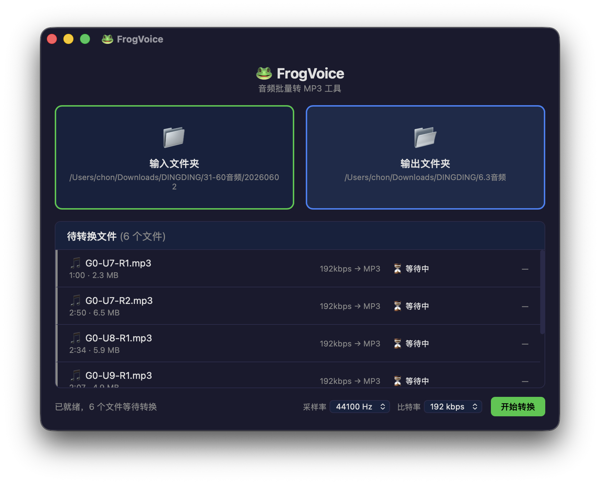

<div align="center">
  
</div>

# 🐸 FrogVoice

音频批量转 MP3 工具 —— 拖入文件夹，一键转换为 192kbps / 44100Hz 立体声 MP3。

<div align="center">
  
</div>

## 支持格式

| 输入 | WAV, MP3, FLAC, AAC, OGG, OGA, M4A, AIFF, AIF, MP4, M4V |
|------|----------------------------------------------------------|
| 输出 | MP3（192kbps CBR, 44100Hz, 立体声）                       |

## 开发

### 环境要求

- [Node.js](https://nodejs.org/) + [pnpm](https://pnpm.io/)
- [Rust](https://www.rust-lang.org/tools/install)
- [Tauri 2 CLI](https://v2.tauri.app/start/prerequisites/)

### 启动开发服务器

```bash
pnpm install
pnpm tauri dev
```

### 构建发布

```bash
# 当前平台
pnpm tauri build

# 或使用脚本
./scripts/build.sh

# 跨平台构建
./scripts/build.sh --target x86_64-pc-windows-msvc
```

### Windows 交叉编译（从 macOS）

前置条件：

```bash
brew install llvm
cargo install xwin
xwin --accept-license splat --output .xwin
rustup target add x86_64-pc-windows-msvc --toolchain nightly
```

构建：

```bash
./scripts/build-windows.sh
```

输出：`src-tauri/target/x86_64-pc-windows-msvc/release/FrogVoice.exe`

## 技术栈

| 层 | 技术 |
|----|------|
| 框架 | [Tauri 2](https://v2.tauri.app/) |
| 前端 | Vue 3 + TypeScript + Vite |
| 音频解码 | [Symphonia](https://github.com/pdeljanov/Symphonia) |
| 重采样 | [Rubato](https://github.com/HEnquist/rubato) |
| MP3 编码 | [LAME](https://lame.sourceforge.io/)（via mp3lame-encoder） |

## 协议

本项目基于 [LGPL-3.0](LICENSE) 协议开源。

项目使用了以下 LGPL 组件：
- [mp3lame-sys](https://github.com/DoumanAsh/mp3lame-sys)（LGPL-3.0）
- [LAME](https://lame.sourceforge.io/)（LGPL-2.0+）

## 推荐IDE

- [VS Code](https://code.visualstudio.com/) + [Vue - Official](https://marketplace.visualstudio.com/items?itemName=Vue.volar) + [Tauri](https://marketplace.visualstudio.com/items?itemName=tauri-apps.tauri-vscode) + [rust-analyzer](https://marketplace.visualstudio.com/items?itemName=rust-lang.rust-analyzer)
